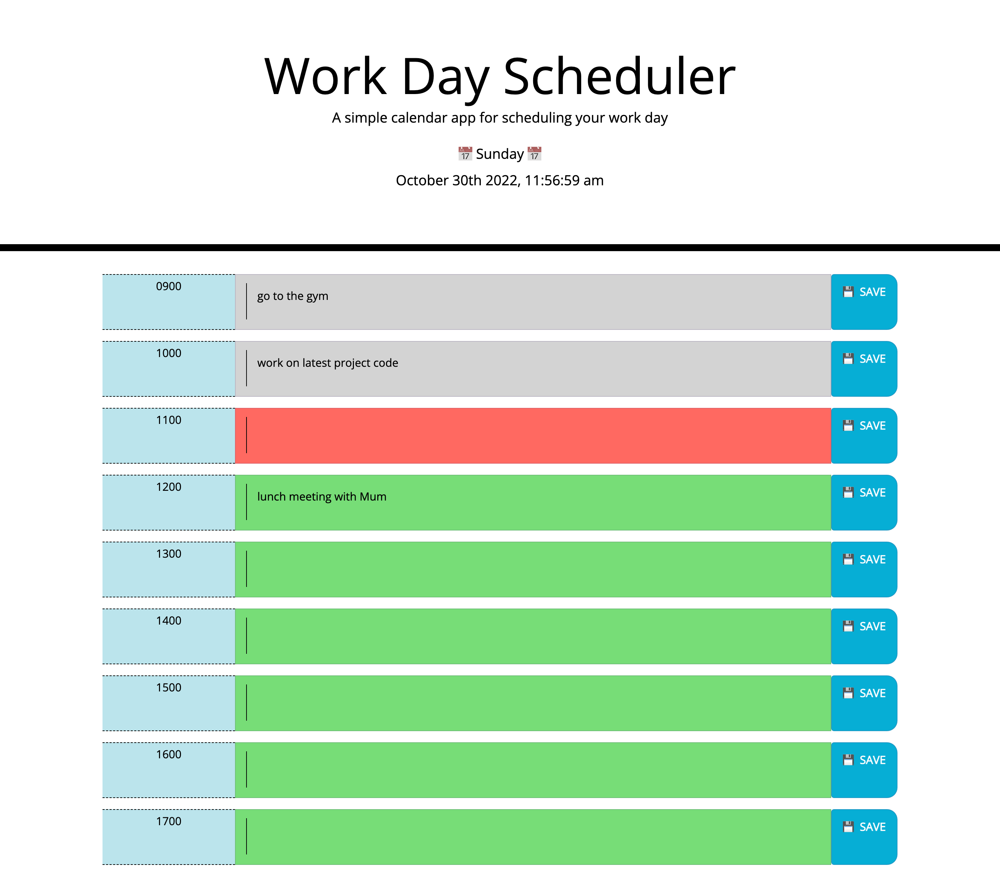

# 05 Third-Party APIs: Work Day Scheduler

## Code Modification and Expansion

Given starter code, the task was to create a simple calendar application that allows a user to save events for each hour of the day by modifying starter code, using jQuery, bootstrap and moment.js.

## User Story

* AS AN employee with a busy schedule
* I WANT to add important events to a daily planner
* SO THAT I can manage my time effectively

## Acceptance Criteria

* GIVEN I am using a daily planner to create a schedule
* WHEN I open the planner
* THEN the current day is displayed at the top of the calendar
* WHEN I scroll down
* THEN I am presented with timeblocks for standard business hours
* WHEN I view the timeblocks for that day
* THEN each timeblock is color coded to indicate whether it is in the past,   present, or future
* WHEN I click into a timeblock
* THEN I can enter an event
* WHEN I click the save button for that timeblock
* THEN the text for that event is saved in local storage
* WHEN I refresh the page
* THEN the saved events persist

The main challenge i faced, was getting to know and understand the logic and syntax of jQuery and Bootstrap, in order to run the functionality ans styling of the calendar. I overcame this by reading forums, looking through tutorials and practising before implementation.

I hope to optimize the calendar further in the future, when i have more knowledge on jQuery and bootstrap.

## Using the code
I have fully commented the JavaScript files, to explain the flow and logic of the calendar, so that others can work on this and expand on it too.

# The Work Day Scheduler 

## Link to deployed application.

<a href="https://enigmawoman.github.io/04-Web-APIs/">Deployed Work Day Scheduler</a>

## Screenshot of the finished website 

## License

NA